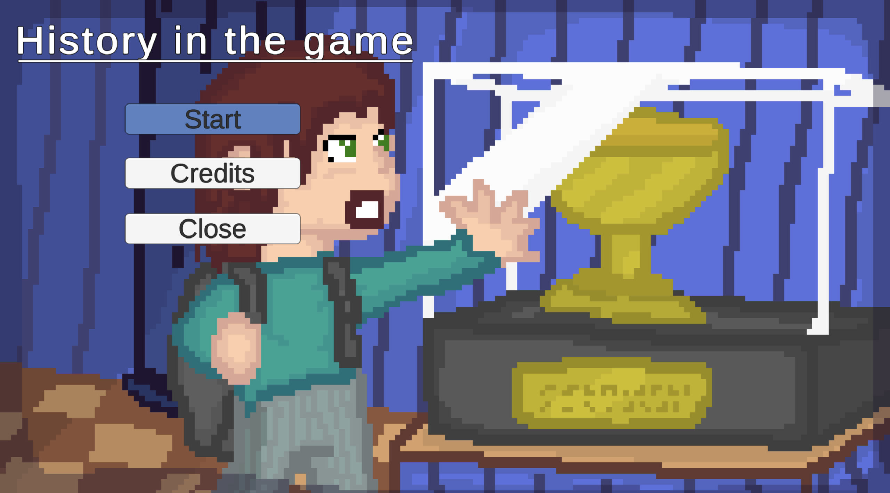
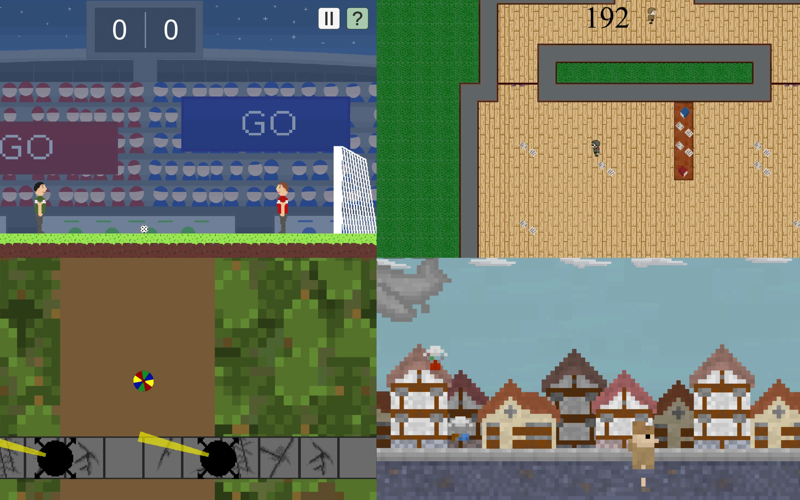

## Seminar Project GIS

Name: "Geschichte im Spiel"

Developers: 7 individuals from Class 12/5 (WMS)

Duration: March 20, 2022 - July 24, 2022

---

### Story:
You're stepping into the shoes of a student exploring a museum exhibit all about the post-war era. You'll be able to interact with objects around you and take a trip back in time, while also enjoying some entertaining mini-games!

---

### Mini-Game Information:

#### Miracle of Bern:

- The goal is to score as many goals as possible within the given time frame
- Controls are explained under the question mark icon
- Requires a minimum of two players

#### Valkyrie:
- The goal is to locate Hitler within the given time frame, place the bomb next to him, and ideally escape
- Controls:
    - "E": Place bomb
    - "F": Hide in the wardrobe
    - "R": Come out of hiding
    - ...? Use Easter Egg (must be found first)
- Tip: Find the stairs to the ground floor

#### Balloon Escape:
- The objective is to reach the goal without touching any obstacles
- Controls:
    - "WASD": Normal movement

#### Candy Collection:
- The goal is to collect as many candies as possible within the given time frame
- Controls are explained under the question mark icon

---

### Technical Specifications:

* Partial controller support is available.
* Most games are single-player, except for one.
* Compatible with Windows, MacOS, and Linux.
* Developed using C# within the Unity environment.
* Unity Version 2021.1.20f1 works fine

Enjoy playing and further developing!!
